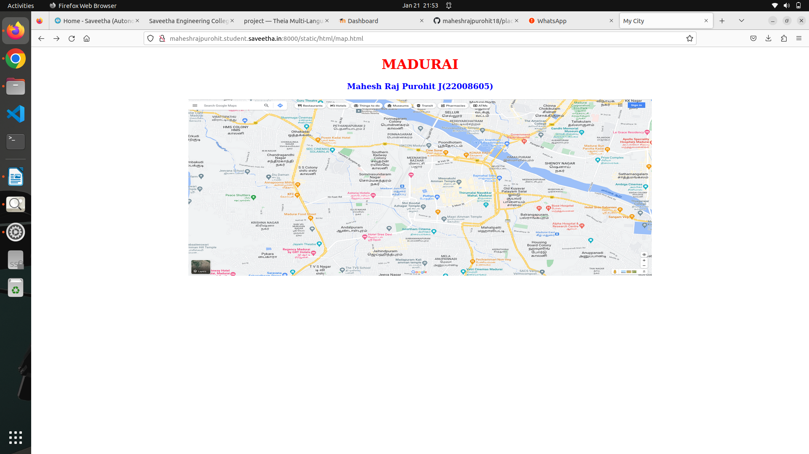
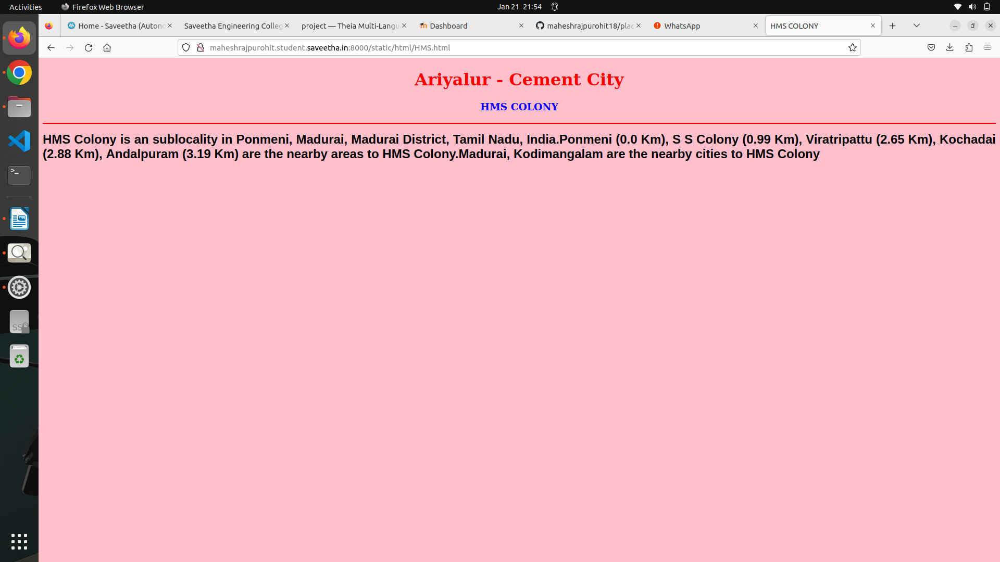
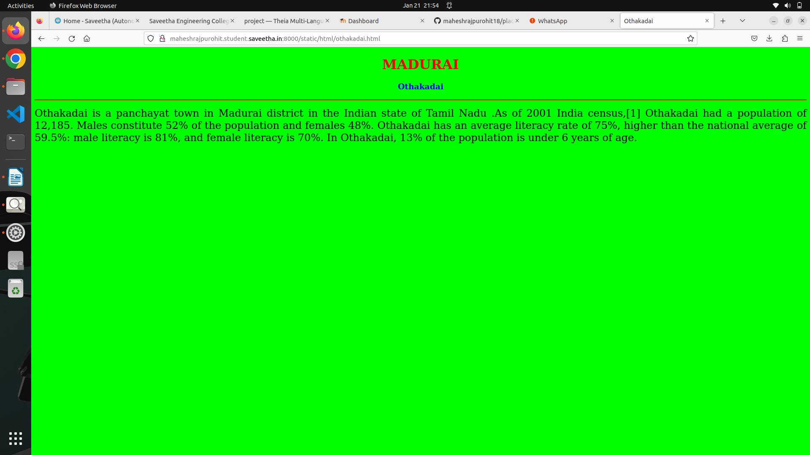
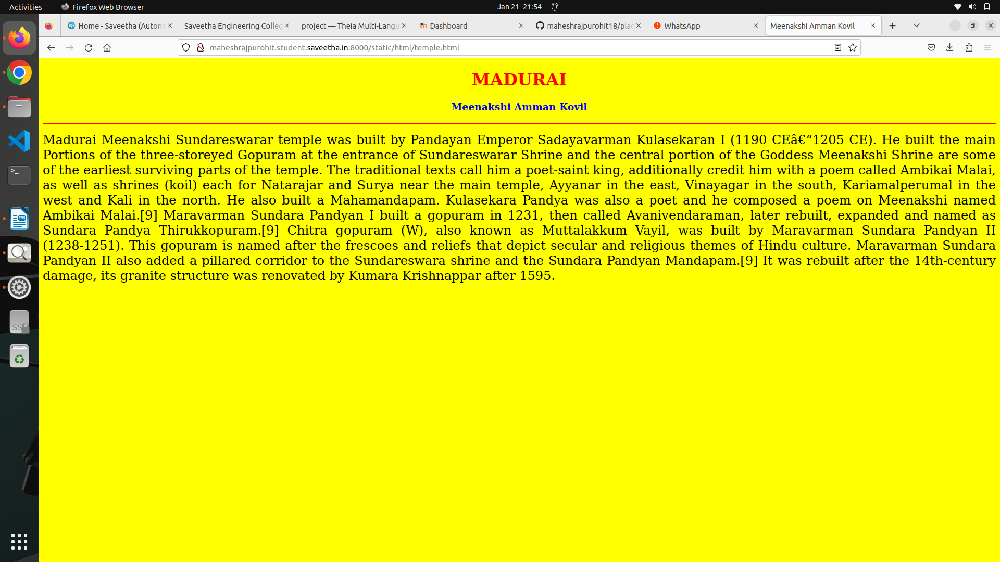
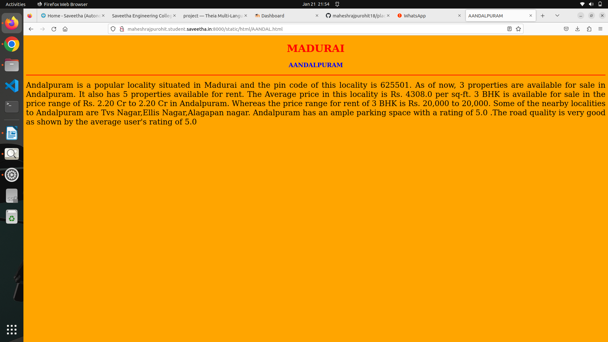
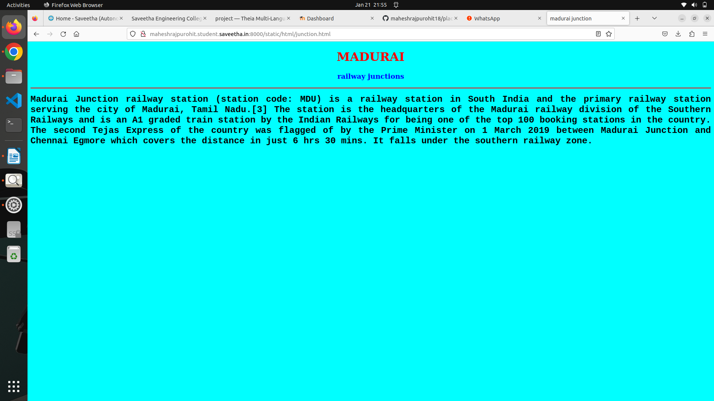
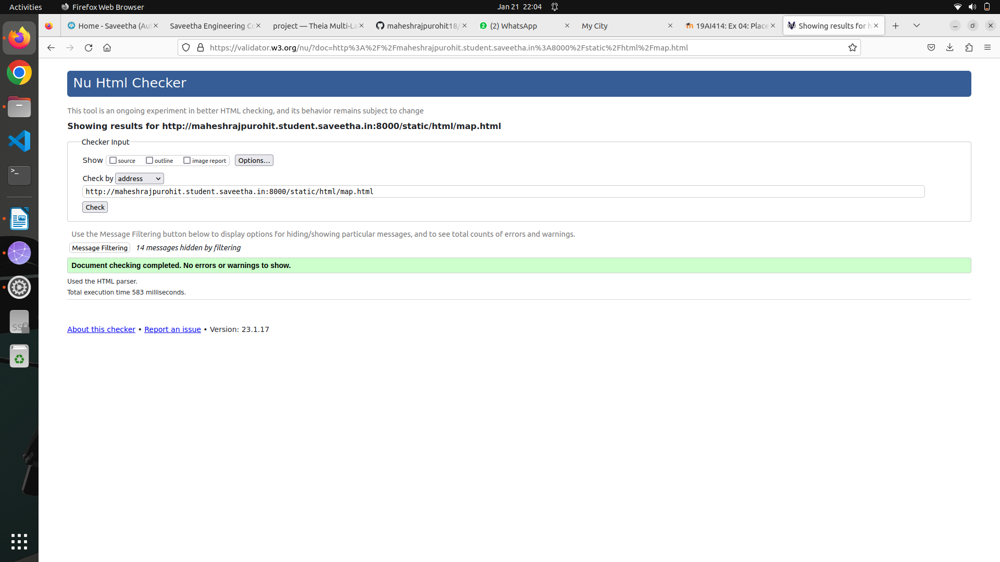

[6:34 pm, 24/01/2023] Surendar N: # Places Around Me
## AIM:
To develop a website to display details about the places around my house.

## Design Steps:

### Step 1:
Clone the github repository into Theia IDE.

### Step 2:
Create a new Django project

### Step 3:
write the needed HTML code.

### Step 4:
Run the Django server and execute the HTML files.

## Code:
```
map.html
<!DOCTYPE html>
<html lang="en">
<head>
<title>My City</title>
</head>
<body>
<h1 align="center">
<font color="red"><b>Raja Mannargudi</b></font>
</h1>
<h3 align="center">
<font color="blue"><b>Surendar N (22008384)</b></font>
</h3>
<center>

<map name="MyCity">
<area shape="circle" coords="190,50,20" href="/static/html/dhms.html" title="Dharani Matric Higher Sec.School">
<area shape="rectangle" coords="230,30,260,60" href="/static/html/post.html" title="post Office">
<area shape="circle" coords="400,350,50" href="/static/html/vk.html" title="Thamarai kulam">
<area shape="circle" coords="400,200,75" href="/static/html/bus.html" title="Hi-Tech Bus Stand">
<area shape="rectangle" coords="490,150,870,320" href="/static/html/temple.html" title="Raja gopalaswamy">
</map>
</center>
</body>
</html>

bus.html
<!DOCTYPE html>
<html lang="en">
<head>
<title>Bus Stand</title>
</head>
<body bgcolor="cyan">
<h1 align="center">
<font color="red"><b>Raja Mannargudi</b></font>
</h1>
<h3 align="center">
<font color="blue"><b>Hi-Tech Bus Stand</b></font>
</h3>
<hr size="3" color="red">
<p align="justify">
<font face="Courier New" size="5">
<b>
Mannargudi (Tamil pronunciation: [mannaːrgɯɖi]) is a town in Thiruvarur district in the Indian state of Tamil Nadu.
 It is the headquarters of the Mannargudi taluk. The town is located at a distance of 28 km (17 mi) from the district 
 headquarters Thiruvarur, 36 km from Kumbakonam, 40 km from Thanjavur and 310 km (190 mi) from the state capital Chennai. 
 Mannargudi is known for the Rajagopalaswamy temple, a prominent Vaishnavite shrine.Mannargudi was founded as an agraharam 
 village by the Medieval Cholas during the 7th century A.D. The town was subsequently ruled by various dynasties including 
 the Chola king Rajadhiraja Chola (1018–1054 CE), Vijayanagar Empire, Delhi Sultanate, Thanjavur Nayaks, Thanjavur Marathas 
 and the British Empire. Mannargudi was a part of the erstwhile Tanjore district until India's independence in 1947 and 
 Thanjavur district until 1991. It subsequently became a part of the newly formed Tiruvarur district. The town is known for
  agriculture, metal working and weaving. The region around Mannargudi has considerable mineral deposits
</b>
</font>
</p>
</body>
</html>

temple.html
<!DOCTYPE html>
<html lang="en">
<head>
<title>Raja gopalaswamy</title>
</head>
<body bgcolor="yellow">
<h1 align="center">
<font color="red"><b>Raja Mannargudi</b></font>
</h1>
<h3 align="center">
<font color="blue"><b>Raja gopalaswamy</b></font>
</h3>
<hr size="3" color="red">
<p align="justify">
<font face="Tahoma" size="5">
Sri Vidhya Rajagopalaswamy temple is a Vaishnava shrine located in the town of Mannargudi, Tamil Nadu, India.[1] The presiding deity is Rajagopalaswamy, a form of Krishna. The temple is spread over an area of 23 acres (93,000 m2) and is an important Vaishnava shrines in India. The temple is called Dakshina Dvaraka (Southern Dvaraka) along with Guruvayoor by Hindus.Originally this ancient temple was first constructed by Kulothunga Chola I at 10th century and Chola Kings Rajaraja Chola III, Rajendra Chola III and later expanded by Thanjavur Nayaks during the 16th century. The temple has three inscriptions from the period and also mention in the religious texts.
</font>
</p>
</body>
</html>

post.html
<!DOCTYPE html>
<html lang="en">
<head>
<title>post Office</title>
</head>
<body bgcolor="pink">
<h1 align="center">
<font color="red"><b>Raja Mannargudi</b></font>
</h1>
<h3 align="center">
<font color="blue"><b>post Office</b></font>
</h3>
<hr size="3" color="red">
<p align="justify">
<font face="Arial" size="5">
<b>
Mannargudi West Post Office is located at Mannargudi West, Mannargudi, Tiruvarur of Tamil Nadu state. It is a branch office (B.O.). A Post Office (PO) / Dak Ghar is a facility in charge of sorting, processing, and delivering mail to recipients. POs are usually regulated and funded by the Government of India (GOI). Pin code of Mannargudi West PO is 614001. This Postoffice falls under Thanjavur postal division of the Tamilnadu postal circle. The related head P.O. for this branch office is Mannargudi head post office and the related sub-post office (S.O.) for this branch office is Haridranathi post office.
</b>
</font>
</p>
</body>
</html>

dhms.html
<!DOCTYPE html>
<html lang="en">
<head>
<title>Dharani. matric. High. Sec. School</title>
</head>
<body bgcolor="lime">
<h1 align="center">
<font color="red"><b>Raja Mannargudi</b></font>
</h1>
<h3 align="center">
<font color="blue"><b>Dharani Matric Higher Sec School</b></font>
</h3>
<hr size="3" color="red">
<p align="justify">
<font face="Georgia" size="5">
Established in year 1999, UAMHSS DHARANI MATRIC, MANNARGUDI is located in Urban area of Tamil Nadu state/ut of India.
 In Mannargudi area of Mannargudi block of Thiruvarur district. Area pincode is 614001.
 school is providing High Secondary level education and is being managed by Private Unaided Organisation.
 This School is one of the most powerfull school in the city. this school is the most popular school in the city.
</font>
</p>
</body>
</html>

vk.html
<!DOCTYPE html>
<html lang="en">
<head>
<title>cholan super mall</title>
</head>
<body bgcolor="orange">
<h1 align="center">
<font color="red"><b>Raja Mannargudi</b></font>
</h1>
<h3 align="center">
<font color="blue"><b>cholan super mall</b></font>
</h3>
<hr size="3" color="red">
<p align="justify">
<font face="Georgia" size="5">
The uses of cholan super mall in Raja Mannargudi are 
<ol type="1">
<li>mall is used for shopping.</li>
<li>It is used for marketing.</li>
<li>Pisculture.</li>
<li>For purchasing,buying cloths etc.</li>
</ol>
</font>
</p>
</body>
</html>
```

## Output:












## HTML Validator

## Result:
The program for implementing image map is executed successfully